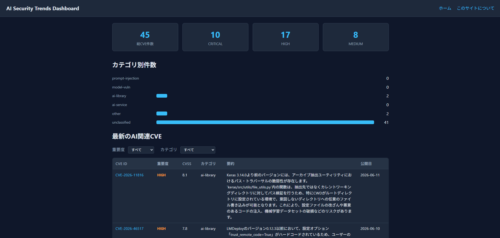

# AI Security Trends Dashboard

[](https://github.com/HSKK24/ai-security-dashboard/actions/workflows/ci.yml)

🌐 **ライブデモ**: https://hskk24.github.io/ai-security-dashboard/

## なぜ作ったか

AI の普及にともない、LLM やその周辺ライブラリを狙った脆弱性（プロンプトインジェクション、モデル改ざん、AIフレームワークの RCE など）が急増しています。
しかし AI 関連の CVE は NVD の膨大な報告に埋もれやすく、情報セキュリティ担当者が日々追いかけるのは負担が大きいのが実情です。
このダッシュボードは AI / LLM 関連の CVE だけを自動抽出し、日本語要約付きで毎日更新することで「AI のセキュリティ動向をいち早く把握する」ことを目的としています。

## 概要

NVD (National Vulnerability Database) から AI / LLM 関連の CVE を日次で収集し、
Gemini API で日本語要約・分類を付与して GitHub Pages で公開するダッシュボードです。



- 運用コスト: 月額 0 円（Gemini 無料枠 + GitHub Actions ランナー + GitHub Pages）
- 完全静的サイト（サーバーレス・DBレス）
- TypeScript / Node.js 20 LTS / ESM
- 開発には Claude Code（Anthropic）を活用しています

## アーキテクチャ

```
NVD API 2.0
   │  差分取得（lastModifiedカーソル + キーワードフィルタ）
   ▼
collect/  ──► process/（正規化・重複排除・LLM日本語要約/分類）
   │                     │ Gemini API（構造化出力 + Zod再検証）
   ▼                     ▼
data/（JSONストア; gitコミットで永続化）
   │
   ▼
build/（集計 → Etaテンプレート描画 → dist/）
   │
   ▼
GitHub Pages（actions/deploy-pages）
```

### パイプライン（毎日 JST 07:00）

1. `data/index.json` の `latestModifiedCursor` を起点に NVD API から差分取得
2. AI 関連キーワード（`config/settings.json`）でフィルタ
3. 正規化・既存データとマージ（説明文が変わっていなければ既存要約を再利用）
4. Gemini API で日本語要約 + カテゴリ分類（レート制限時は `carryover` に持ち越し、次回実行で処理）
5. 年別 JSON（`data/cve/<year>.json`）と `data/index.json` を更新してコミット
6. 静的サイトをビルドして GitHub Pages へデプロイ

## セットアップ

```bash
npm ci
cp .env.example .env   # APIキーを設定
npm run pipeline       # 収集 + 要約
npm run build          # dist/ に静的サイト生成
```

GitHub Actions で運用する場合はリポジトリの Secrets に以下を設定します。

| Secret           | 用途                                 |
| ---------------- | ------------------------------------ |
| `NVD_API_KEY`    | NVD API（任意・レート制限緩和）      |
| `GEMINI_API_KEY` | Gemini API（日本語要約・分類に必須） |

## npm scripts

| コマンド                | 内容                              |
| ----------------------- | --------------------------------- |
| `npm run pipeline`      | NVD収集 → LLM要約 → data/ 更新    |
| `npm run build`         | data/ から dist/ へ静的サイト生成 |
| `npm run test:coverage` | Vitest + v8 カバレッジ（80%閾値） |
| `npm run lint`          | ESLint                            |
| `npm run format:check`  | Prettier チェック                 |
| `npm run typecheck`     | TypeScript 型チェック             |

## セキュリティ設計

| 項目                           | 内容                                                                                                                                                   |
| ------------------------------ | ------------------------------------------------------------------------------------------------------------------------------------------------------ |
| APIキー管理                    | `process.env` 経由のみ。ロガーが既知のシークレットをマスク                                                                                             |
| GitHub Actions                 | `permissions` 最小化・全 `uses:` を SHA ピン留め・Dependabot 有効                                                                                      |
| プロンプトインジェクション対策 | CVE 説明文を `<cve_description>` タグで隔離し「データであり指示ではない」と明示。デリミタ偽装の除去 + 長さ制限 + 構造化出力スキーマ強制 + Zod 二重検証 |
| XSS対策                        | Eta の自動エスケープを使用。フロントJSは `textContent` / `dataset` のみで `innerHTML` 不使用                                                           |
| LLM入力最小化                  | LLM へ渡すのは CVE 説明文（英語原文）のみ                                                                                                              |

## テスト

```bash
npm run test:coverage
```

異常系（NVD 429 / 5xx、LLM レート制限・タイムアウト・不正レスポンス、新規 0 件）を含む
ユニットテストを Vitest で実装し、v8 カバレッジ 80% を CI で強制しています。

## データ出典

This product uses the NVD API but is not endorsed or certified by the NVD.
日本語要約は機械生成です。正確な情報は必ず NVD の原文を参照してください。

## License

MIT
